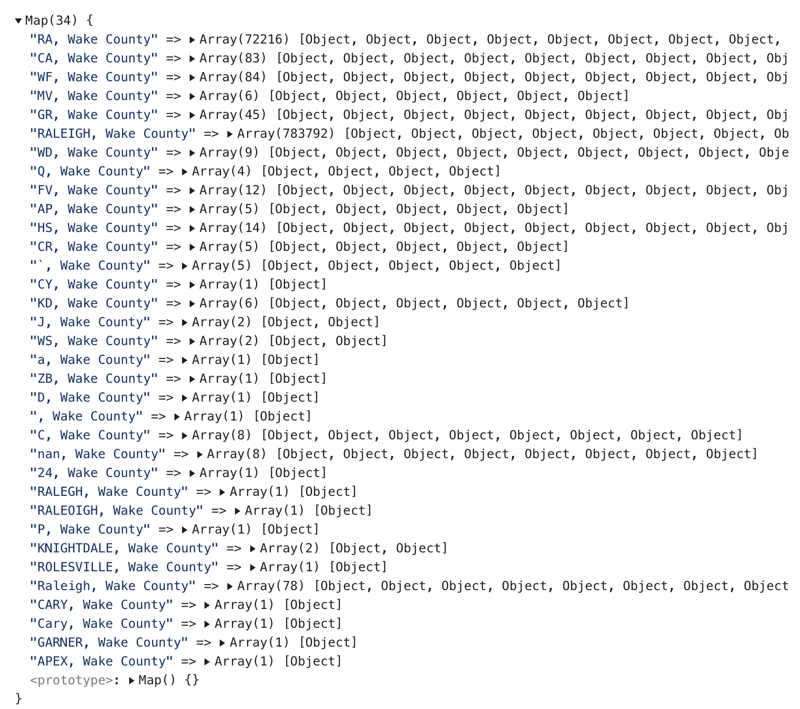

# Normalizing Values in Datasets

Sometimes data are messy. The reasons are many, but you should be aware that you should watch out for odd and varied values within columns, so you can normalize your values accordingly.

Here's a case of police stop data within Wake County. Let's say after we group our data by the available feature of `location`, I realize that there are some odd redundancies and errors for the same part of Wake County vary, due to human error.

<p class="figure-caption cc-image">
  Grouped police stop data by <code>.location</code> feature.
</p>



Note how Raleigh alone appears as five different values:

1. `"RA, Wake County"`
2. `"Raleigh, Wake County"`
3. `"RALEIGH, Wake County"`
4. `"RALEGH, Wake County"`
5. `"RALEOIGH, Wake County"`

Another set of issues, after looking more closely at locations: they're not all at the same level. Sometimes the data use township names and other times they use city names.

Due to these two issues, my normalization solution must decide how to replace and make existing values consistent through a replacement method. In this case, I learned that a goal to map the data within the county would be easiest at the township level, so I will normalize the data by township, which means I need to verify which cities in the data reside within which townships.

Once I have all of the info to normalize the data, I can use a customized Map(), wherein:

- **Keys** == the messy value, and
- **Values** == Township value of which to replace the messy value

<p class="codeblock-caption cc-image">
  Custom Map() of messy values as keys to the appropriate normalized value.
</p>

```javascript
const LOCATIONS = new Map(
  [
    ["RA, Wake County", "RALEIGH"],
    ["Raleigh, Wake County", "RALEIGH"],
    ["RALEIGH, Wake County", "RALEIGH"],
    ["RALEGH, Wake County", "RALEIGH"],
    ["RALEOIGH, Wake County", "RALEIGH"],
    ["CA, Wake County", "CARY"],
    ["CR, Wake County", "CARY"],
    ["CY, Wake County", "CARY"],
    ["C, Wake County", "CARY"],
    ["CARY, Wake County", "CARY"],
    ["Cary, Wake County", "CARY"],
    ["WF, Wake County", "WAKE FOREST"],
    ["ROLESVILLE, Wake County", "WAKE FOREST"],
    ["MV, Wake County", "CEDAR FORK"],
    ["GR, Wake County", "SAINT MARY'S"],
    ["GARNER, Wake County", "SAINT MARY'S"],
    ["WD, Wake County", "MARKS CREEK"],
    ["Q, Wake County", "MIDDLE CREEK"],
    ["FV, Wake County", "MIDDLE CREEK"],
    ["AP, Wake County", "WHITE OAK"],
    ["APEX, Wake County", "WHITE OAK"],
    ["HS, Wake County", "HOLLY SPRINGS"],
    ["KD, Wake County", "SAINT MATTHEWS"],
    ["KNIGHTDALE, Wake County", "SAINT MATTHEWS"],
    ["P, Wake County", "PANTHER BRANCH"],
    ["ZB, Wake County", "LITTLE RIVER"],
    ["D, Wake County", "Durham"],
    ["`, Wake County", "UNKNOWN"],
    ["J, Wake County", "UNKNOWN"],
    ["WS, Wake County", "UNKNOWN"],
    ["a, Wake County", "UNKNOWN"],
    [", Wake County", "UNKNOWN"],
    ["nan, Wake County", "UNKNOWN"],
    ["24, Wake County", "UNKNOWN"],
  ]
)
```

## How to Use a Custom Map() to Normalize Values

Now that I wrote a custom map of values, I can use it in a function that will perform the following task:

1. Use JS Map()'s `.get()` method that uses the incoming messy value at .location as a key.
2. Return the normalized township name that is keyed to the messy value. If the key does not find any values in the `Map()`, I will return `"NOT_FOUND"`, so I can isolate any new issues that I may have missed.

<p class="codeblock-caption cc-image">
  Function that will use my custom Map() to return a normalized value for each row of data.
</p>

<!-- Create functions to test and return desired normed value for row's property -->
```javascript
/** normalizeLocation()
 * Normalize .location values and
 * map unknown or empty inputs as "UNKNOWN"
**/ 
const normalizeLocation = (d) => {
  /**
   * Use .get() to retrieve the keyed varied value
   * linked to a value that will normalize it.
   * EXAMPLES:
   *  - Incoming value of `"RALEOIGH, Wake County"`
   *    will return a normed value of `"RALEIGH"`
   *  - Incoming value of `"RA, Wake County"`
   *    will return a normed value of `"RALEIGH"`
  **/
  const newNormal = LOCATIONS.get(d)

  if ( (newNormal != null) || (newNormal != "") ) {
    return newNormal
  }
  else {
    return "NOT_FOUND"
  }

}
```

Once I define my normalizing function, I can use it within a .map() function, so it runs when I wish to create a new keyed property in my dataset, as seen in the example code below. Note how I retain the original property.

<p class="codeblock-caption cc-image">
  Calling my function within a .map() that creates a new normalized keyed property, but retains the original as well.
</p>

```javascript
const ncPoliceStopsNormalized = ncPoliceStops.map(
  (d) => ({
    original_location: d.location,
    // Call normalizeLocation() and pass the original location value,
    // which will be used as a key in our Map(). The function
    // returns the desired normed value set in our Map()
    township_name: normalizeLocation(d.location),
  })
)
```